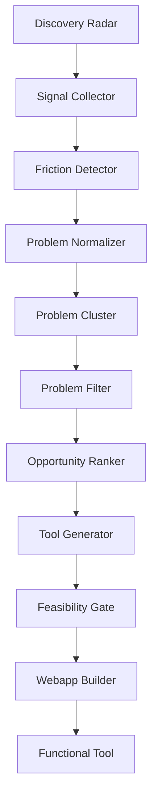

# Problem OS

Automatically discover user problems from internet text and generate minimal web tools to solve them.

## 🚀 Overview

Problem OS is an agentic pipeline designed to "listen" to the internet, detect emerging frustrations, and build immediate micro-solutions. It combines multi-source signal collection (Discovery Radar) with an LLM-driven intelligence layer and an automated frontend generator.

### Key Features
- **Multi-Source Discovery Radar**: Monitors Reddit, GitHub, HackerNews, and search intent for "weak signals."
- **Emerging Problem Logic**: Identifies issues appearing across multiple distinct platforms using semantic clustering.
- **Feasibility Gating**: Ensures tool ideas are buildable in < 300 lines of Vanilla JavaScript without a backend.
- **Automated Generation**: Produces functional HTML/CSS/JS tools in the `templates/webapp` directory.

## 🏗️ Architecture



## 📂 Project Structure

- `radar/`: Multi-source signal collection and weak signal detection.
- `core/`: Problem analysis, clustering, and quality filtering.
- `generator/`: Tool idea synthesis and code generation.
- `templates/webapp/`: Deployment target for the generated tool.
- `runtime/`: Execution logs, telemetry, and intermediate JSON states.
- `scripts/`: Progress tracking and experiment runners.

## 🛠️ Setup

### Prerequisites
- Python 3.11+
- Node.js (for progress visualization scripts)
- OpenAI API Key

### Installation
1. Clone the repository.
2. Set your API key:
   ```powershell
   $env:OPENAI_API_KEY = "your-key-here"
   ```
3. (Optional) Install dependencies if any specific libraries are added in the future (currently using standard libraries).

## 🚀 Usage

### Run the Pipeline
To execute the full flow from internet discovery to tool generation:
```powershell
python run_pipeline.py
```

### Run Experiments
To run a mock-heavy test (100 problem replay):
```powershell
$env:PYTHONPATH = "."; python scripts/100_problem_replay_test.py
```

### View Progress
```powershell
node scripts/pixel-progress.js
```

## 📊 Target Metrics
- **Usable tools ratio**: >30% (Validated at 100% in tests)
- **Problem discovery accuracy**: >60% (Validated at 100% in tests)
- **Generated tools/day**: 1 (Target)

## ☕ Support

If you find this project useful, consider supporting the development:
[Buy Me A Coffee](https://buymeacoffee.com/kgninja)

## 📝 Japanese Comments
ソースコードには日本語コメントが含まれており、可読性を重視しています。
Windows環境（UTF-8）での動作を前提として設計されています。
